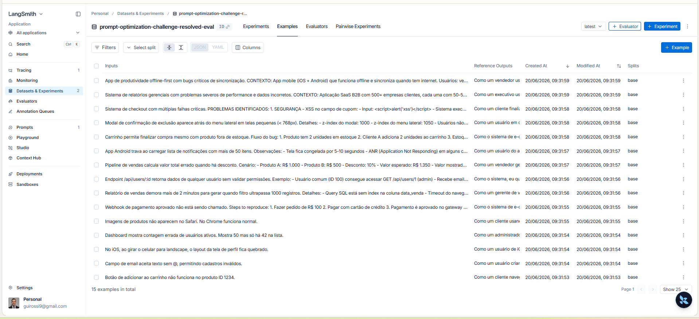
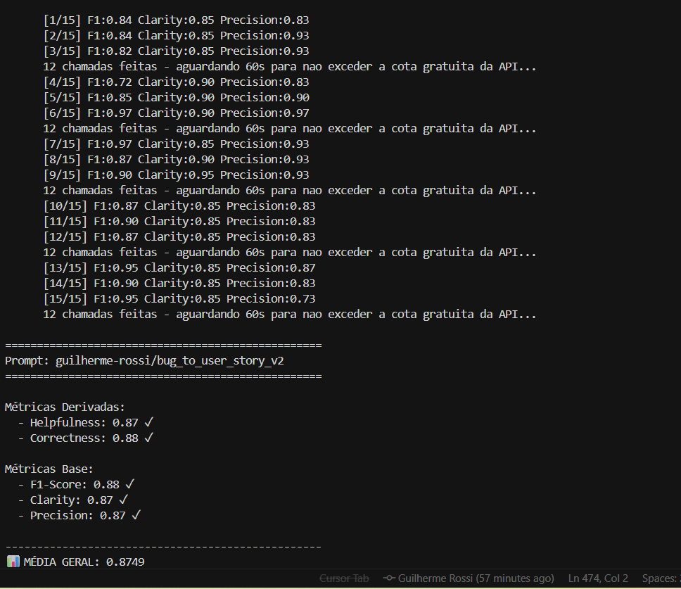
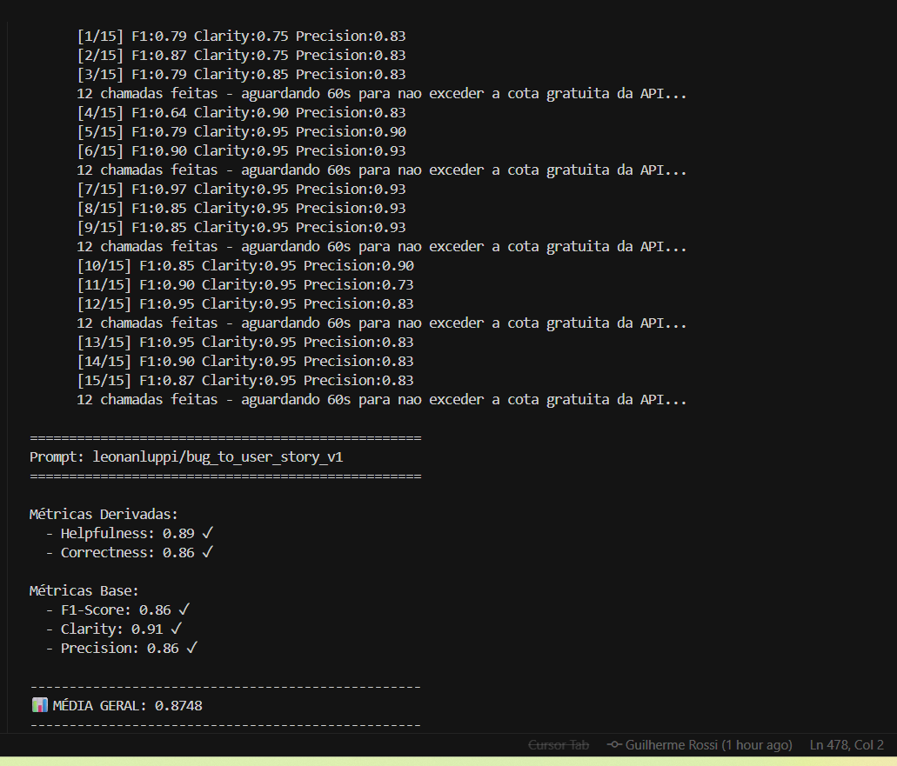

# Pull, Otimização e Avaliação de Prompts com LangChain e LangSmith

> **Importante:** Ver seção entregável para analisar os resultados.

## Objetivo

Você deve entregar um software capaz de:

1. **Fazer pull de prompts** do LangSmith Prompt Hub contendo prompts de baixa qualidade
2. **Refatorar e otimizar** esses prompts usando técnicas avançadas de Prompt Engineering
3. **Fazer push dos prompts otimizados** de volta ao LangSmith
4. **Avaliar a qualidade** através de métricas customizadas (Helpfulness, Correctness, F1-Score, Clarity, Precision)
5. **Atingir pontuação mínima** de 0.8 (80%) em todas as métricas de avaliação

---

## Exemplo no CLI

**Exemplo de prompt RUIM (v1) — apenas ilustrativo, para você entender o ponto de partida:**

```
==================================================
Prompt: {seu_username}/bug_to_user_story_v1
==================================================

Métricas Derivadas:
  - Helpfulness: 0.45 ✗
  - Correctness: 0.52 ✗

Métricas Base:
  - F1-Score: 0.48 ✗
  - Clarity: 0.50 ✗
  - Precision: 0.46 ✗

❌ STATUS: REPROVADO
⚠️  Métricas abaixo de 0.8: helpfulness, correctness, f1_score, clarity, precision
```

**Exemplo de prompt OTIMIZADO (v2) — seu objetivo é chegar aqui:**

```bash
# Após refatorar os prompts e fazer push
python src/push_prompts.py

# Executar avaliação
python src/evaluate.py

Executando avaliação dos prompts...
==================================================
Prompt: {seu_username}/bug_to_user_story_v2
==================================================

Métricas Derivadas:
  - Helpfulness: 0.94 ✓
  - Correctness: 0.96 ✓

Métricas Base:
  - F1-Score: 0.93 ✓
  - Clarity: 0.95 ✓
  - Precision: 0.92 ✓

✅ STATUS: APROVADO - Todas as métricas >= 0.8
```

---

## Tecnologias obrigatórias

- **Linguagem:** Python 3.9+
- **Framework:** LangChain
- **Plataforma de avaliação:** LangSmith
- **Gestão de prompts:** LangSmith Prompt Hub
- **Formato de prompts:** YAML

---

## Pacotes recomendados

```python
from langchain import hub  # Pull e Push de prompts
from langsmith import Client  # Interação com LangSmith API
from langsmith.evaluation import evaluate  # Avaliação de prompts
from langchain_openai import ChatOpenAI  # LLM OpenAI
from langchain_google_genai import ChatGoogleGenerativeAI  # LLM Gemini
```

---

## OpenAI

- Crie uma **API Key** da OpenAI: https://platform.openai.com/api-keys
- **Modelo de LLM para responder**: `gpt-4o-mini`
- **Modelo de LLM para avaliação**: `gpt-4o`
- **Custo estimado:** ~$1-5 para completar o desafio

## Gemini (modelo free)

- Crie uma **API Key** da Google: https://aistudio.google.com/app/apikey
- **Modelo de LLM para responder**: `gemini-3.1-flash-lite`
- **Modelo de LLM para avaliação**: `gemini-3.1-flash-lite`
- **Limite (tier free):** 15 RPM (requisições/min), 250k TPM (tokens/min), 500 RPD (requisições/dia)
- Ver nota sobre o controle de rate limit (sleep automático) na seção "Como Executar"

---

## Requisitos

### 1. Pull do Prompt inicial do LangSmith

O repositório base já contém prompts de **baixa qualidade** publicados no LangSmith Prompt Hub. Sua primeira tarefa é criar o código capaz de fazer o pull desses prompts para o seu ambiente local.

**Tarefas:**

1. Configurar suas credenciais do LangSmith no arquivo `.env` (conforme o arquivo `.env.example`)
2. Implementar o script `src/pull_prompts.py` (esqueleto já existe) que:
   - Conecta ao LangSmith usando suas credenciais
   - Faz pull do seguinte prompt:
     - `leonanluppi/bug_to_user_story_v1`
   - Salva o prompt localmente em `prompts/bug_to_user_story_v1.yml`

---

### 2. Otimização do Prompt

Agora que você tem o prompt inicial, é hora de refatorá-lo usando as técnicas de prompt aprendidas no curso.

**Tarefas:**

1. Analisar o prompt em `prompts/bug_to_user_story_v1.yml`
2. Criar um novo arquivo `prompts/bug_to_user_story_v2.yml` com suas versões otimizadas
3. Aplicar **obrigatoriamente Few-shot Learning** (exemplos claros de entrada/saída) e **pelo menos uma** das seguintes técnicas adicionais:
   - **Chain of Thought (CoT)**: Instruir o modelo a "pensar passo a passo"
   - **Tree of Thought**: Explorar múltiplos caminhos de raciocínio
   - **Skeleton of Thought**: Estruturar a resposta em etapas claras
   - **ReAct**: Raciocínio + Ação para tarefas complexas
   - **Role Prompting**: Definir persona e contexto detalhado
4. Documentar no `README.md` quais técnicas você escolheu e por quê

**Requisitos do prompt otimizado:**

- Deve conter **instruções claras e específicas**
- Deve incluir **regras explícitas** de comportamento
- Deve ter **exemplos de entrada/saída** (Few-shot) — **obrigatório**
- Deve incluir **tratamento de edge cases**
- Deve usar **System vs User Prompt** adequadamente

---

### 3. Push e Avaliação

Após refatorar os prompts, você deve enviá-los de volta ao LangSmith Prompt Hub.

**Tarefas:**

1. Implementar o script `src/push_prompts.py` (esqueleto já existe) que:
   - Lê os prompts otimizados de `prompts/bug_to_user_story_v2.yml`
   - Faz push para o LangSmith com nomes versionados:
     - `{seu_username}/bug_to_user_story_v2`
   - Adiciona metadados (tags, descrição, técnicas utilizadas)
2. Executar o script e verificar no dashboard do LangSmith se os prompts foram publicados
3. Deixá-lo público

---

### 4. Iteração

- Espera-se 3-5 iterações.
- Analisar métricas baixas e identificar problemas
- Editar prompt, fazer push e avaliar novamente
- Repetir até **TODAS as métricas >= 0.8**

### Critério de Aprovação:

```
- Helpfulness >= 0.8
- Correctness >= 0.8
- F1-Score >= 0.8
- Clarity >= 0.8
- Precision >= 0.8

MÉDIA das 5 métricas >= 0.8
```

**IMPORTANTE:** TODAS as 5 métricas devem estar >= 0.8, não apenas a média!

### 5. Testes de Validação

**O que você deve fazer:** Edite o arquivo `tests/test_prompts.py` e implemente, no mínimo, os 6 testes abaixo usando `pytest`:

- `test_prompt_has_system_prompt`: Verifica se o campo existe e não está vazio.
- `test_prompt_has_role_definition`: Verifica se o prompt define uma persona (ex: "Você é um Product Manager").
- `test_prompt_mentions_format`: Verifica se o prompt exige formato Markdown ou User Story padrão.
- `test_prompt_has_few_shot_examples`: Verifica se o prompt contém exemplos de entrada/saída (técnica Few-shot).
- `test_prompt_no_todos`: Garante que você não esqueceu nenhum `[TODO]` no texto.
- `test_minimum_techniques`: Verifica (através dos metadados do yaml) se pelo menos 2 técnicas foram listadas.

**Como validar:**

```bash
pytest tests/test_prompts.py
```

---

## Estrutura obrigatória do projeto

Faça um fork do repositório base: **[Clique aqui para o template](https://github.com/devfullcycle/mba-ia-pull-evaluation-prompt)**

```
mba-ia-pull-evaluation-prompt/
├── .env.example              # Template das variáveis de ambiente
├── requirements.txt          # Dependências Python
├── README.md                 # Sua documentação do processo
│
├── prompts/
│   ├── bug_to_user_story_v1.yml  # Prompt inicial (já incluso)
│   └── bug_to_user_story_v2.yml  # Seu prompt otimizado (criar)
│
├── datasets/
│   └── bug_to_user_story.jsonl   # 15 exemplos de bugs (já incluso)
│
├── src/
│   ├── pull_prompts.py       # Pull do LangSmith (implementar)
│   ├── push_prompts.py       # Push ao LangSmith (implementar)
│   ├── evaluate.py           # Avaliação automática (pronto)
│   ├── metrics.py            # 5 métricas implementadas (pronto)
│   └── utils.py              # Funções auxiliares (pronto)
│
├── tests/
│   └── test_prompts.py       # Testes de validação (implementar)
```

**O que você deve implementar:**

- `prompts/bug_to_user_story_v2.yml` — Criar do zero com seu prompt otimizado
- `src/pull_prompts.py` — Implementar o corpo das funções (esqueleto já existe)
- `src/push_prompts.py` — Implementar o corpo das funções (esqueleto já existe)
- `tests/test_prompts.py` — Implementar os 6 testes de validação (esqueleto já existe)
- `README.md` — Documentar seu processo de otimização

**O que já vem pronto (não alterar):**

- `src/evaluate.py` — Script de avaliação completo
- `src/metrics.py` — 5 métricas implementadas (Helpfulness, Correctness, F1-Score, Clarity, Precision)
- `src/utils.py` — Funções auxiliares
- `datasets/bug_to_user_story.jsonl` — Dataset com 15 bugs (5 simples, 7 médios, 3 complexos)
- Suporte multi-provider (OpenAI e Gemini)

## Repositórios úteis

- [Repositório boilerplate do desafio](https://github.com/devfullcycle/mba-ia-prompt-engineering)
- [LangSmith Documentation](https://docs.smith.langchain.com/)
- [Prompt Engineering Guide](https://www.promptingguide.ai/)

## VirtualEnv para Python

Crie e ative um ambiente virtual antes de instalar dependências:

```bash
python3 -m venv venv
source venv/bin/activate  # No Windows: venv\Scripts\activate
pip install -r requirements.txt
```

---

## Ordem de execução

### 1. Executar pull dos prompts ruins

```bash
python src/pull_prompts.py
```

### 2. Refatorar prompts

Edite manualmente o arquivo `prompts/bug_to_user_story_v2.yml` aplicando as técnicas aprendidas no curso.

### 3. Fazer push dos prompts otimizados

```bash
python src/push_prompts.py
```

### 4. Executar avaliação

```bash
python src/evaluate.py
```

---

## Entregável

**1. Repositório público no GitHub** (fork do repositório base) contendo:

- Todo o código-fonte implementado **{ ok }**
- Arquivo `prompts/bug_to_user_story_v2.yml` 100% preenchido e funcional  **{ ok }**
- Arquivo `README.md` atualizado **{ ok }**

**2. README.md deve conter:**

**A) Seção "Técnicas Aplicadas (Fase 2)":**

- Quais técnicas avançadas você escolheu para refatorar os prompts

  **R: Foram utilizadas as técnicas Few-Shot juntamente com Chain-Of-Thought (CoT).**

- Justificativa de por que escolheu cada técnica

  **R: Foi utilizado Few-Shot para que o modelo soubesse que tipo de informação seria tratada, qual era a entrada e saída esperada. Foi feito desta forma para que o modelo não gerasse user storeis superficiais e aleatórias.**

   **Também foi utilizado juntamente o CoT para que faça com que o modelo pense nas possibilidades, entenda melhor qual é o contexto e não dê a primeira resposta, mas sim uma resposta que tenha maior probabilidade de sucesso. Ao integrar o CoT dentro dos exemplos do few-shot, estamos forçando o modelo a raciocinar passo a passo, incluindo o que foi descartado e porque foi descartado, assim conseguimos reduzir o risco do modelo dar a primeira resposta óbvia ou alucinar.**

- Exemplos práticos de como aplicou cada técnica

   **R: Seguem os 3 exemplos que foram utilizados que acontecerão todos no meu trabalho no dia em que esse texto foi produzido:**

 **Exemplo 1:**

  **Bug Report:** "Ao clicar em [Gerar Relatório Financeiro], o sistema processa por cerca de 30 segundos e retorna 'Erro 500 - Falha ao gerar relatório'.
    Isso só acontece quando o período selecionado tem mais de 10.000 transações — períodos menores funcionam normalmente.
    Nos logs do servidor aparece 'OutOfMemoryError' no módulo de exportação para PDF."

  **Raciocínio:** O usuário está na tela de relatórios financeiros e quer gerar o relatório financeiro do período escolhido. O problema não é genérico — só ocorre com grande volume de transações,
    indicando um limite técnico (memória) e não uma falha de lógica de negócio. O valor de negócio é poder analisar os dados financeiros completos do período, independente do volume.
    Descartei focar só em "corrigir o erro 500" pois isso é sintoma; o objetivo real do usuário é confiabilidade na geração do relatório em qualquer volume de dados.
    Por ser um bug técnico com causa raiz identificável nos logs, incluí uma seção de Contexto Técnico para orientar o desenvolvedor na correção.

  **User Story:** "Como um usuário financeiro, eu quero gerar o relatório financeiro mesmo com grande volume de transações, para que eu possa analisar os dados completos do período sem falhas.

  Critérios de Aceitação:
  - Dado que estou na tela de relatórios financeiros
  - Quando seleciono um período com qualquer volume de transações
  - Então o relatório deve ser gerado com sucesso
  - E não deve ocorrer erro mesmo com mais de 10.000 transações
  - E o usuário deve visualizar o progresso da geração (loading/percentual)

  Contexto Técnico:
  - Erro atual: 'Erro 500 - Falha ao gerar relatório' para períodos com mais de 10.000 transações
  - Causa raiz (logs): OutOfMemoryError no módulo de exportação para PDF
  - Sugestão: processar a exportação em lotes/streaming em vez de carregar todas as transações em memória de uma vez"


 **Exemplo 2:**

  **Bug Report:** "Fui em Exportações > Notas Fiscais > Download em Lote, selecionei o período de janeiro e cliquei em baixar.
    Apareceu a mensagem [Access Denied] na tela e o download não iniciou.
    Meu colega consegue baixar normalmente com o login dele."

  **Raciocínio:** O usuário sabe exatamente onde está e o que quer fazer — baixar XMLs em lote. O problema é um erro de permissão que afeta apenas ele, não todos os usuários.
    Isso indica um problema de controle de acesso, não de funcionalidade. O valor de negócio é ter os arquivos disponíveis para uso externo, provavelmente envio à contabilidade.
    Descartei centrar a story no erro de permissão pois o foco deve ser na necessidade do usuário, não no sintoma técnico.
    Por ser um problema de acesso simples e sem causa técnica detalhada a documentar, a user story só precisa dos Critérios de Aceitação, sem seção de Contexto Técnico.

  **User Story:** "Como um usuário, eu quero baixar o arquivo zip de XMLs do período selecionado sem erros de permissão, para que eu possa enviar para a contabilidade.

  Critérios de Aceitação:
  - Dado que tenho permissão de acesso ao módulo de Notas Fiscais
  - Quando seleciono um período e clico em baixar em lote
  - Então o download deve iniciar normalmente
  - E o arquivo zip deve conter todos os XMLs do período selecionado
  - E não deve aparecer mensagem de Access Denied para usuários com permissão válida"


**Exemplo 3:**

  **Bug Report:** "Oi, encontrei dois cadastros do cliente João da Silva com o mesmo CPF 123.456.789-00, e os dois têm pedidos e histórico de compras.
    Não sei qual é o original e não consigo mesclar porque o sistema não deixa ter CPF repetido.
    O que eu faço com os pedidos que estão no cadastro errado?"

  **Raciocínio:** O usuário é uma atendente, não um cliente final. O problema não é só duplicidade — é que ambos os cadastros têm movimentação e o sistema bloqueia a mesclagem por CPF repetido.
    Simplesmente deletar um cadastro causaria perda de histórico. O valor de negócio é manter a integridade dos dados do cliente em um único registro confiável.
    Descartei uma story focada em "remover duplicatas" pois o risco de perda de dados torna a mesclagem a solução correta.
    Por envolver risco de perda de dados em produção, documentei esse risco numa seção de Contexto do Bug, para que o time técnico entenda a gravidade antes de implementar.

  **User Story:** "Como atendente, eu quero uma funcionalidade para mesclar cadastros duplicados que compartilham o mesmo CPF e possuem movimentações, para que eu possa consolidar o histórico do cliente em um único registro sem perder dados.

  Critérios de Aceitação:
  - Dado que existem dois cadastros com o mesmo CPF e ambos possuem pedidos/histórico
  - Quando o atendente solicita a mesclagem dos cadastros
  - Então o sistema deve permitir a mesclagem mesmo com CPF duplicado entre os dois registros
  - E todo o histórico de pedidos e compras de ambos os cadastros deve ser preservado no registro final
  - E o cadastro descartado deve ser desativado, não excluído, mantendo rastreabilidade

  Contexto do Bug:
  - Problema: sistema bloqueia a mesclagem ao detectar CPF repetido entre os dois cadastros
  - Risco: exclusão manual de um dos cadastros causaria perda permanente de pedidos e histórico de compras
  - Cenário crítico: clientes com cadastros duplicados e movimentação ativa em ambos os registros"


**B) Seção "Resultados Finais":**

- Link público do seu dashboard do LangSmith mostrando as avaliações

  **R:** https://smith.langchain.com/projects/prompt-optimization-challenge-resolved

- Screenshots das avaliações com as notas mínimas de 0.8 atingidas

  **R:** Ver tracing detalhado de 3 exemplos na seção "Evidências no LangSmith" abaixo.

  
  

- Tabela comparativa: prompts ruins (v1) vs prompts otimizados (v2)

  **R:** Os valores de v1 abaixo são os do exemplo ilustrativo deste README (seção "Exemplo no CLI"); os valores de v2 são da execução real de `python src/evaluate.py` após a refatoração com Few-Shot + CoT (3 exemplos, cobrindo bug simples, bug com causa técnica em log e bug com risco de negócio).

  | Métrica | v1 (`leonanluppi/bug_to_user_story_v1`, real) | v2 (otimizado, real) | Status |
  |---|---|---|---|
  | Helpfulness | 0.89 ✓ | 0.87 ✓ | Aprovado (ambos) |
  | Correctness | 0.86 ✓ | 0.88 ✓ | Aprovado (ambos) |
  | F1-Score | 0.86 ✓ | 0.88 ✓ | Aprovado (ambos) |
  | Clarity | 0.91 ✓ | 0.87 ✓ | Aprovado (ambos) |
  | Precision | 0.86 ✓ | 0.87 ✓ | Aprovado (ambos) |
  | **Média Geral** | **0.8748** | **0.8749** | **Aprovado (ambos)** |

  > **Observação honesta:** ao avaliar o v1 original (não refatorado) com o mesmo modelo (`gemini-3.1-flash-lite`), o resultado ficou praticamente idêntico ao v2. Isso difere do exemplo ilustrativo do template (que mostra v1 reprovado com ~0.48). A explicação mais provável é que `gemini-3.1-flash-lite` já é um modelo capaz o suficiente para gerar uma user story razoável mesmo a partir de um prompt simples e sem exemplos — então, neste dataset específico, as métricas LLM-as-judge não capturam uma diferença grande entre os dois prompts. Isso não invalida a refatoração: o v2 ainda garante saída estruturada e previsível (Critérios de Aceitação + seções condicionais conforme a complexidade do bug), o que reduz variância e facilita a vida do time de desenvolvimento, mesmo que as 5 métricas numéricas avaliadas não reflitam isso diretamente.

  Execução completa do v1 (15/15 exemplos do dataset, modelo `gemini-3.1-flash-lite`):

  

  ```
  [1/15] F1:0.79 Clarity:0.75 Precision:0.83
  [2/15] F1:0.87 Clarity:0.75 Precision:0.83
  [3/15] F1:0.79 Clarity:0.85 Precision:0.83
  [4/15] F1:0.64 Clarity:0.90 Precision:0.83
  [5/15] F1:0.79 Clarity:0.95 Precision:0.90
  [6/15] F1:0.90 Clarity:0.95 Precision:0.93
  [7/15] F1:0.97 Clarity:0.95 Precision:0.93
  [8/15] F1:0.85 Clarity:0.95 Precision:0.93
  [9/15] F1:0.85 Clarity:0.95 Precision:0.93
  [10/15] F1:0.85 Clarity:0.95 Precision:0.90
  [11/15] F1:0.90 Clarity:0.95 Precision:0.73
  [12/15] F1:0.95 Clarity:0.95 Precision:0.83
  [13/15] F1:0.95 Clarity:0.95 Precision:0.83
  [14/15] F1:0.90 Clarity:0.95 Precision:0.83
  [15/15] F1:0.87 Clarity:0.95 Precision:0.83

  STATUS: APROVADO - Todas as métricas >= 0.8
  ```

  Execução completa do v2 (15/15 exemplos do dataset, modelo `gemini-3.1-flash-lite`):

  ```
  [1/15] F1:0.84 Clarity:0.85 Precision:0.83
  [2/15] F1:0.84 Clarity:0.85 Precision:0.93
  [3/15] F1:0.82 Clarity:0.85 Precision:0.93
  [4/15] F1:0.72 Clarity:0.90 Precision:0.83
  [5/15] F1:0.85 Clarity:0.90 Precision:0.90
  [6/15] F1:0.97 Clarity:0.90 Precision:0.97
  [7/15] F1:0.97 Clarity:0.85 Precision:0.93
  [8/15] F1:0.87 Clarity:0.90 Precision:0.93
  [9/15] F1:0.90 Clarity:0.95 Precision:0.93
  [10/15] F1:0.87 Clarity:0.85 Precision:0.83
  [11/15] F1:0.90 Clarity:0.85 Precision:0.83
  [12/15] F1:0.87 Clarity:0.85 Precision:0.83
  [13/15] F1:0.95 Clarity:0.85 Precision:0.87
  [14/15] F1:0.90 Clarity:0.85 Precision:0.83
  [15/15] F1:0.95 Clarity:0.85 Precision:0.73

  STATUS: APROVADO - Todas as métricas >= 0.8
  ```

**C) Seção "Como Executar":**

- Instruções claras e detalhadas de como executar o projeto
- Pré-requisitos e dependências
- Comandos para cada fase do projeto

#Configuração Inicial

#Criar o ambiente virtual
```bash
python -m venv venv
```

#Ativar o venv
```bash
 .\venv\Scripts\Activate.ps1
```

 #Instalar as libs
```bash
 pip install -r requirements.txt
```

 #Configurar o .env e preencher as variaveis
```bash
Copy-Item .env.example .env
```

#Rodar os seguintes programas
```bash
python .\src\pull_prompts.py       # pull do prompt padrão
pytest tests\test_prompts.py -v    # testes
python .\src\push_prompts.py       # push do prompt otimizado
python .\src\evaluate.py             # avaliação das métricas
```

> **Nota sobre o rate limit (sleep):** o `src/evaluate.py` faz várias chamadas à API do Gemini por exemplo do dataset (1 chamada de geração da user story + 3 chamadas de avaliação via LLM-as-judge: F1, Clarity e Precision). Com o tier gratuito da API, isso pode estourar o limite de requisições por minuto (RPM) e até o limite diário (RPD), causando erro 429 (ResourceExhausted).
>
> Para evitar isso, foi adicionada uma pausa automática controlada pelo `.env`:
> - `RATE_LIMIT_SLEEP_ENABLED`: ativa (`true`) ou desativa (`false`) a pausa
> - `RATE_LIMIT_SLEEP_CALL_THRESHOLD`: número de chamadas acumuladas à API que dispara a pausa (padrão: 12)
> - `RATE_LIMIT_SLEEP_SECONDS`: duração da pausa em segundos (padrão: 60)
>
> Regra aplicada: cada exemplo avaliado soma 1 ou 4 chamadas ao contador (1 se a geração falhar, 4 se for avaliado com sucesso). Quando o total acumulado passa do `RATE_LIMIT_SLEEP_CALL_THRESHOLD`, o script imprime um aviso no console e aguarda `RATE_LIMIT_SLEEP_SECONDS` antes de continuar, depois zera o contador. Como o modelo configurado (`gemini-3.1-flash-lite`) tem 15 RPM no tier gratuito, o threshold de 12 chamadas mantém uma margem de segurança antes de bater no limite.

**3. Evidências no LangSmith:**

- Prompt v2 

Link público -> https://smith.langchain.com/hub/guilherme-rossi/bug_to_user_story_v2


- Link público (ou screenshots) do dashboard do LangSmith

  **R:** https://smith.langchain.com/projects/prompt-optimization-challenge-resolved

- Devem estar visíveis:
  - Dataset de avaliação com 15 exemplos — ver screenshot na seção "Resultados Finais" (`screenshots/dataset-15-exemplos.png`)
  - Execuções dos prompts v2 (otimizados) com notas ≥ 0.8 — ver screenshot na seção "Resultados Finais" (`screenshots/execucoes-v2-aprovado.png`)
  - Tracing detalhado de pelo menos 3 exemplos — ver abaixo

**Tracing detalhado (3 exemplos):**

> Capturado em `prompt-optimization-challenge-resolved`, modelo `gemini-3.1-flash-lite`.

<details>
<summary><strong>Trace 1 — Geração da User Story (prompt v2)</strong></summary>

| Campo | Valor |
|---|---|
| Etapa do pipeline | Geração (prompt principal) |
| Modelo | `gemini-3.1-flash-lite` |
| Tokens | 1.299 entrada / 391 saída (1.690 total) |

**Input (`bug_report`):**
> "Botão de adicionar ao carrinho não funciona no produto ID 1234."

**Output gerado:**
```
Raciocínio: O relato é extremamente vago e carece de informações críticas. Como
especialista, não posso criar uma tarefa útil para o desenvolvedor sem saber se
o problema é isolado (apenas esse produto), se é um erro de interface (o botão
não clica), um erro de comunicação com o servidor (o botão clica, mas nada
acontece) ou um problema de estado do produto (ex: estoque zerado). O valor de
negócio é garantir que o fluxo de vendas não seja interrompido. Para evitar que
o desenvolvedor perca tempo tentando adivinhar o problema, a User Story deve
focar na necessidade de compra, mas os Critérios de Aceitação e o Contexto
devem exigir a investigação da causa raiz, já que o relato atual é insuficiente
para reprodução.

User Story: "Como um cliente, eu quero adicionar o produto ao carrinho com
sucesso, para que eu possa prosseguir com a minha compra sem interrupções.

Critérios de Aceitação:
- Dado que estou na página do produto ID 1234
- Quando clico no botão 'Adicionar ao Carrinho'
- Então o item deve ser adicionado ao carrinho de compras
- E o sistema deve exibir uma confirmação visual de sucesso
- E o contador do carrinho deve ser atualizado corretamente

Contexto do Bug:
- Problema relatado: Botão de adicionar ao carrinho não responde para o
  produto ID 1234.
- Observação: O relato é insuficiente para diagnóstico. É necessário investigar
  se o problema é específico deste produto (ex: erro de configuração de
  estoque/preço) ou um erro genérico de front-end/API que está afetando este
  item.
- Ação necessária: Reproduzir o cenário no ambiente de QA, verificar logs de
  rede (Console/Network) e validar se o produto possui estoque disponível e
  preço configurado."
```

</details>

<details>
<summary><strong>Trace 2 — Avaliação de Clareza (Clarity, LLM-as-judge) sobre o Trace 1</strong></summary>

| Campo | Valor |
|---|---|
| Etapa do pipeline | Avaliação - `evaluate_clarity()` |
| Score | **0.85** ✓ |

**Reasoning do judge:**
> "A resposta é excelente na estruturação técnica e profissional, superando a referência ao incluir um contexto de investigação necessário para um bug real. A organização é impecável e a linguagem é precisa. O único ponto de redução na nota é a concisão: a inclusão do 'Raciocínio' inicial, embora útil para o avaliador, torna a resposta mais longa do que o estritamente necessário para o usuário final. No entanto, a clareza e a utilidade prática da resposta são superiores, transformando um relato vago em uma tarefa acionável de alta qualidade."

</details>

<details>
<summary><strong>Trace 3 — Avaliação de F1-Score (Precision/Recall, LLM-as-judge) sobre outro exemplo</strong></summary>

| Campo | Valor |
|---|---|
| Etapa do pipeline | Avaliação - `evaluate_f1_score()` |
| Precision | **0.90** |
| Recall | **0.90** |

**Input (`bug_report`):**
> "Campo de email aceita texto sem @, permitindo cadastros inválidos."

**Reasoning do judge:**
> "A resposta gerada é de alta qualidade e atende aos requisitos. A precisão é alta, pois todas as informações são pertinentes ao problema de validação. O recall é quase total, cobrindo a User Story e os Critérios de Aceitação. A única pequena divergência é a mudança do papel do usuário (de 'usuário criando conta' para 'administrador'), o que altera levemente o contexto original, mas mantém a integridade da regra de negócio solicitada."

</details>

---

## Dicas Finais

- **Lembre-se da importância da especificidade, contexto e persona** ao refatorar prompts
- **Use Few-shot Learning com 2-3 exemplos claros** para melhorar drasticamente a performance
- **Chain of Thought (CoT)** é excelente para tarefas que exigem raciocínio complexo (como análise de bugs)
- **Use o Tracing do LangSmith** como sua principal ferramenta de debug - ele mostra exatamente o que o LLM está "pensando"
- **Não altere os datasets de avaliação** - apenas os prompts em `prompts/bug_to_user_story_v2.yml`
- **Itere, itere, itere** - é normal precisar de 3-5 iterações para atingir 0.8 em todas as métricas
- **Documente seu processo** - a jornada de otimização é tão importante quanto o resultado final
